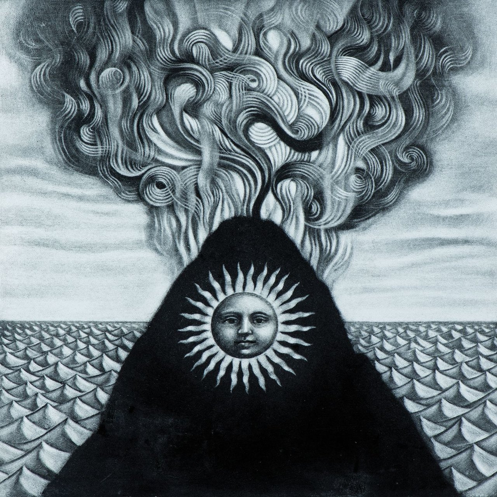
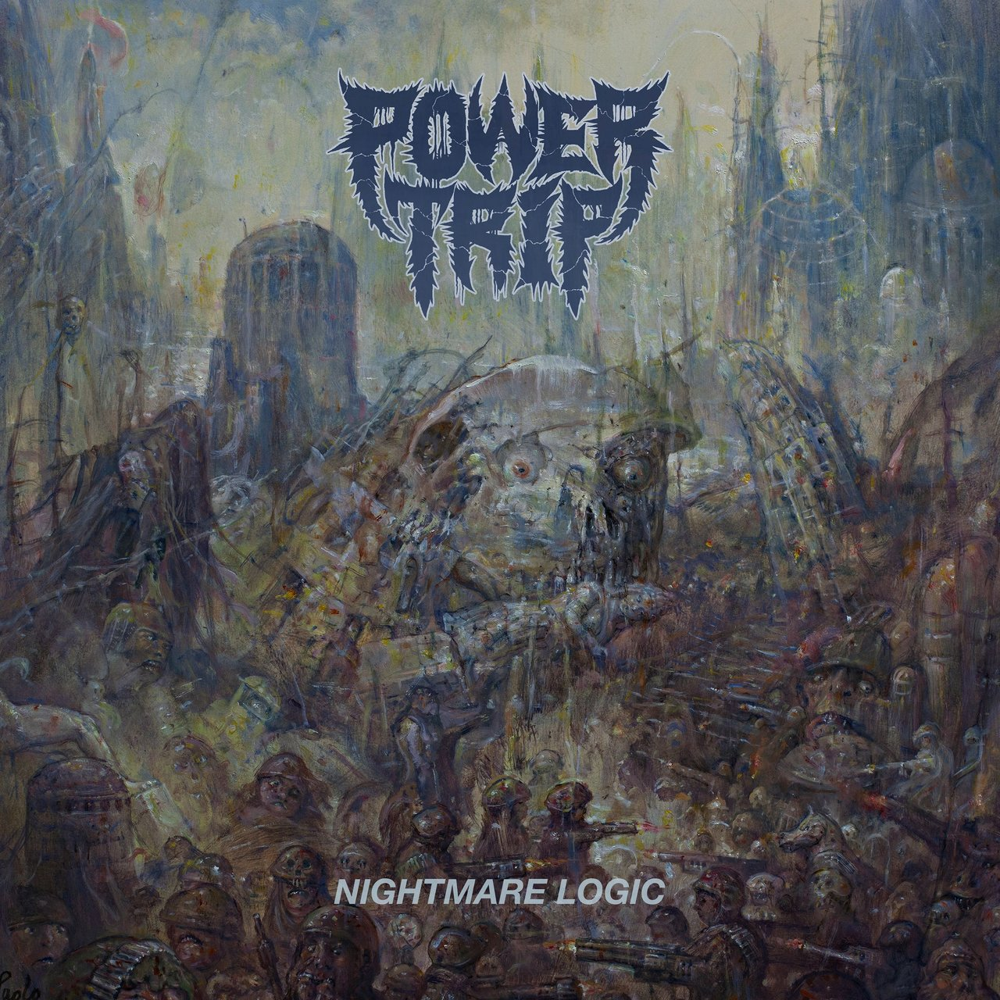
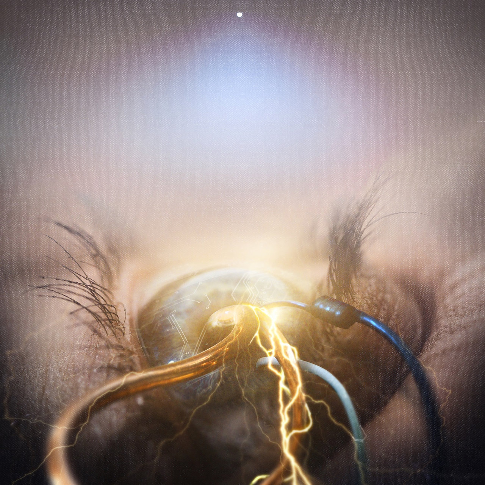
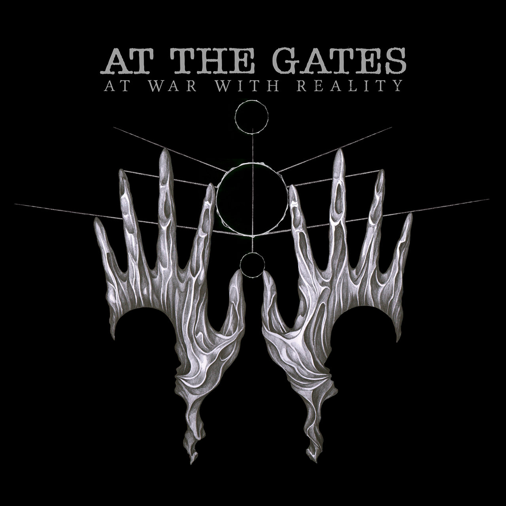

<h1 align="center">× ᴋᴀʟɪᴍᴇᴅᴀ ×</h1>

    
    
    

    Estudiante de informática, afín al desarrollo de software ^. .^₎⟆
     
    Tecnología al servicio de los pueblos; software libre, abierto y accesible.

    <i>Podrán cortar todas las flores, pero nunca terminarán con la primavera.</i>

<h2 align="center">× ᴛᴇᴄɴᴏʟᴏɢɪ́ᴀꜱ ×</h2>

    &nbsp;&nbsp;
    &nbsp;&nbsp;
    &nbsp;&nbsp;
    &nbsp;&nbsp;
    &nbsp;&nbsp;
    &nbsp;&nbsp;
    &nbsp;&nbsp;
    &nbsp;&nbsp;

    &nbsp;&nbsp;
    &nbsp;&nbsp;
    &nbsp;&nbsp;
    &nbsp;&nbsp;
    &nbsp;&nbsp;
    &nbsp;&nbsp;
    &nbsp;&nbsp;

<h2 align="center">× ᴀʟʙᴜᴍꜱ ×</h2>

    
    
    
    
    

